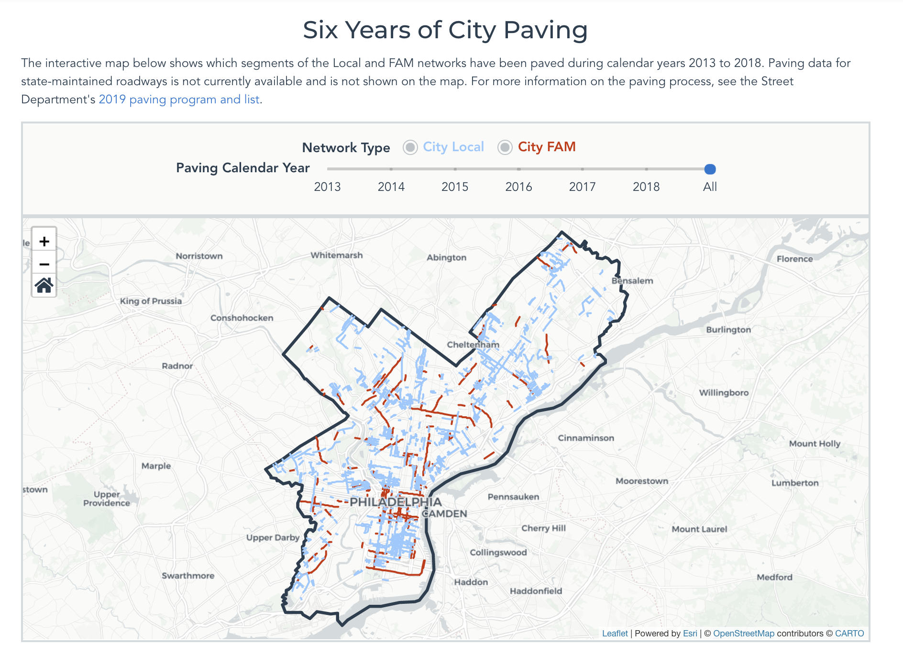
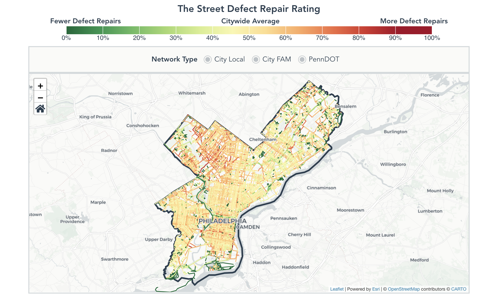
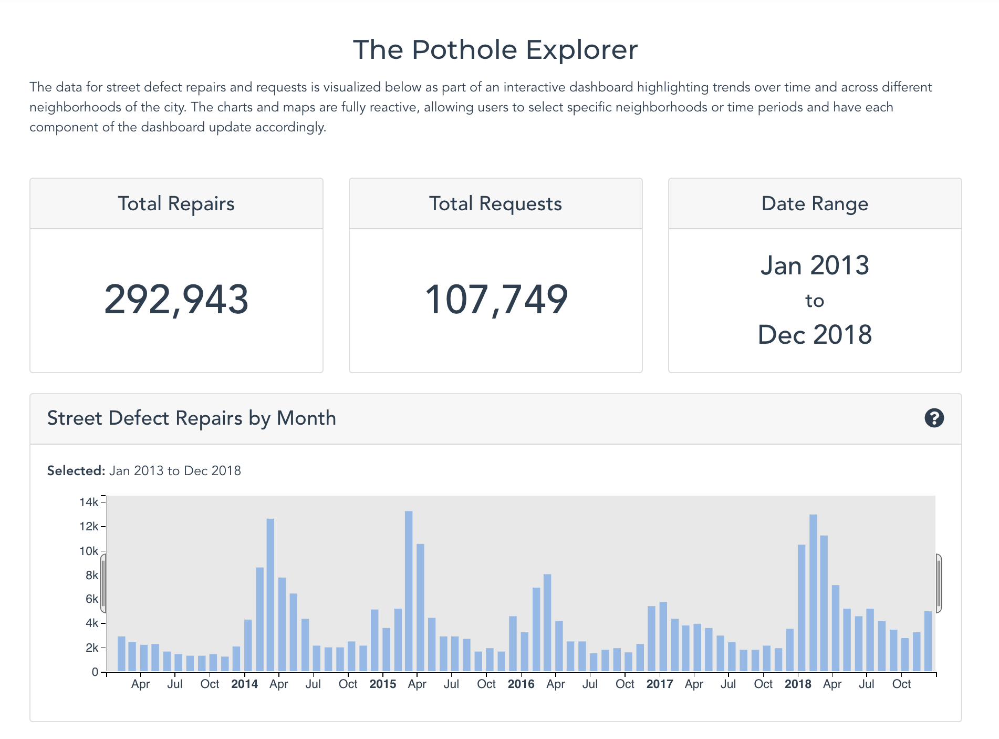

# PavingAndPotholes

The code behind the interactive visualization of the City of Philadelphia's recent history
of paving and potholes.

The interactive visualization is available [here](https://controller.phila.gov/philadelphia-audits/data-release-paving-and-potholes/#/).





## Tools

Built using vue, d3, [dc.js](https://github.com/dc-js/dc.js), [esri-leaflet](https://github.com/Esri/esri-leaflet), and [vue-apexcharts](https://github.com/apexcharts/vue-apexcharts)

## Development

#### Compiles and hot-reloads for development

```
npm run serve
```

#### Compiles and minifies for production

```
npm run build
```
